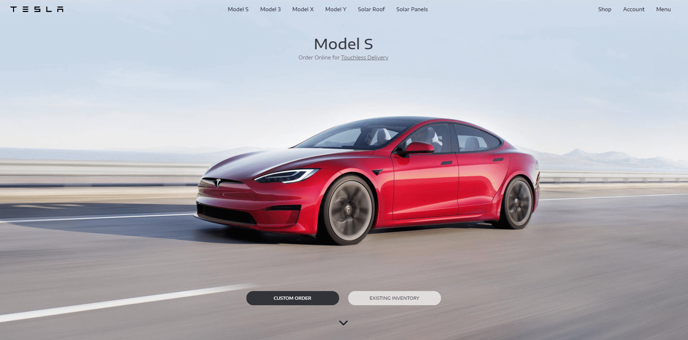

# Tesla Clone


Tesla Home Page UI Clone using React/Redux.

## Installation

At first, clone the project into a folder and then open Terminal and type :

```bash
npm install
```

after node_modules installed, use this to run project in development mode :

```bash
npm start
```

## Build

This command builds the app for production to the `build` folder :

```bash
npm run build
```

## About

I am [Reza Mehdipour](https://linkedin.com/in/rezamehdipour) and this project is one of my first projects on my journey to become a good Front-end Developer :)

## Thanks

Thanks for checking this repo, hope you enjoy!
